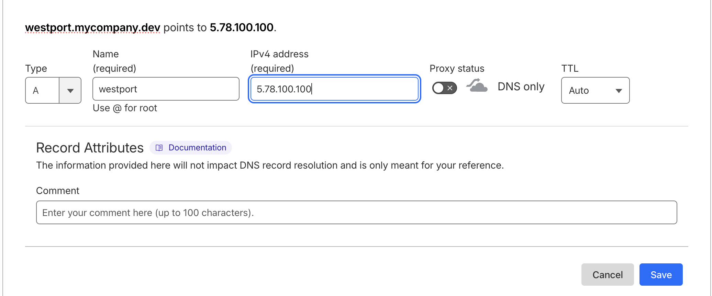
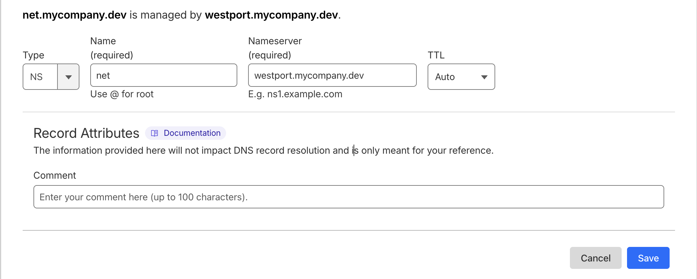

# West

Global mesh networking for distributed datacenters.

> ⚠️ West has not yet hit v1 and it's api shouldn't be considered stable

## Features  

- 🌍 Connect to your network from anywhere in the world.
- 🔐 Private subnet for your services / apps.
  - Services can be bound to the internal network and will be completely unreachable externally.
  - Only your devices can send traffic
- 🪄 Magic DNS with bring your own subdomain
  - IP to DNS names are managed by West. Communicate by device name.
    - `ssh myserver.net.mycompany.dev`
- 🚂 API Device Provisioning
  - Register new devices as needed.
  - Use the provisioning token to connect devices from anywhere.


## Install

**Snap / Ubuntu (auto updates)**

```sh
snap install west
sudo snap connect west:network-control   # Snap requires manual connection for vpn creation
```

**Homebrew (auto updates)**

```sh
brew install sprisa/tap/west
```

**Golang (manual version selection)**

```sh
go install github.com/sprisa/west/cmd/west@latest   # Install latest
go install github.com/sprisa/west/cmd/west@v0.0.2   # Install specific version

# Run by name
west help
# Or binary directly if go bin is not in PATH
~/go/bin/west help
```

**Manual Install**  
Grab a release asset for your machine specific build from [Github](https://github.com/sprisa/west/releases/latest).

## Getting Started

You'll need:

- A publicly accessible IP address and server.
  - [Digital Ocean](https://www.digitalocean.com/) and [Hetzner](hetzner.com) have some low cost options (~$5/mo)
- A domain name or subdomain zone [Optional]
  - Without a domain you will not have magic dns support. If you prefer to only connect via an IP address this could be fine for you.
- A couple devices you want to connect
- 20 minutes

Ready? Let's begin 🔥

### 0) Install West on your server

See the install steps. For this example we will be using the following options:

```yaml
# Replace with your server info, when seen in install steps
Public IP: 5.78.100.100
Subdomain: net.mycompany.dev
```

Here is our device topology:

```
port (my server running west port)
home (my home laptop)
api  (my api server)
```

Let's install. For example, we are using ubuntu on our server and api:

```sh
sudo snap install west
sudo snap connect west:network-control
```

And using MacOS on our home device:

```sh
brew install sprisa/tap/west
```

### 1) Generate Nebula Certificate Authority

> 💡 This will probably be moved into west for convenience

West uses Nebula to sign certificates. We can generate ca certs using the [nebula-cert command](https://nebula.defined.net/docs/guides/quick-start/#creating-your-first-certificate-authority).

With golang installed:

```sh
go run github.com/slackhq/nebula/cmd/nebula-cert@latest ca -name "My Company, Inc"
```

Or with [downloading Nebula manually](https://nebula.defined.net/docs/guides/quick-start/#downloading-nebula):

```sh
./nebula-cert ca -name "My Company, Inc"
```

You should now have a `ca.crt` and `ca.key` file in your current directory ✨

### 2) Install and Run West Port

West Port is a central management server for all west devices.  
It handles creating peer to peer device connections, device provisioning, and magic dns.

Let's install our server configuration for our domain name.  
You will be prompted for a encryption password. Remember this or better yet store it in your secret management service.

```sh
west port install \
  --domain-zone net.mycompany.dev \        # domain-zone can be excluded if you prefer no dns support.
  --letsencrypt-email hi@mycompany.dev \   # For automatic tls certs with Let's Encrypt
  --letsencrypt-accept-tos                 # You must accept the Let's Encrypt terms and conditions to use automated tls certs.
```

Now let's start the server.  
You'll need that same encryption password.

```sh
# Will prompt for password
sudo west port start
# West can also read the password from stdin.
# Useful for piping in from your secrets store (infisical in this case).
infisical secrets get WEST_PORT_PASSWORD | sudo west port start
```

> 💡 There is no built in daemon yet but you can build one with systemd

> 💡 On ubuntu, you may need to [disable the default dns server](https://unix.stackexchange.com/q/676942) so port 53 is freed.

You should see Nebula, the API, and DNS server all running ✨  

The `ca.crt` and `ca.key` files have been imported into West and encrypted with your password. These files are now safe to delete.  

### 3) Configure your Subdomain NS records

In order the DNS resolver to work so we can communicate with `home.net.mycompany.dev`, we need to setup some DNS records. This looks a bit different depending on what domain provider you use.

**First**, configure an `A` record pointing at your west-port server.  

For example: `westport.mycompany.dev` and using Cloudflare DNS. Do not use Cloudflare proxying.  


> 💡 This can be any subdomain. It doesn't have to by the same under your internal network domain zone. Any DNS record with your west port IP as the A record will work.

**Next**, we configure a `NS` record for the internal network domain. `net.mycompany.dev` in this case.


All Done ✨  
NS record takes some time to propagate. Make sure west port is running otherwise other global nameserver may not recognize yours as valid!

### 4) Register your West Devices

Let's add some devices and starting building our network!  
In our example we need to add both `home` and `api`

Each device will need a unique name and ip.

```sh
# Register home device
west port add --name home --ip 10.10.10.2
# Register api device
west port add --name api --ip 10.10.10.3
```

All good to go ✨  
Make sure to save the secret tokens outputted from these two commands. These will be used for the west devices to connect.

### 5) Run West on all devices

Adding our two devices will complete the mesh network.

On each device, `home` and `api` in our case, run `west start` and pass in that secret token you saved.

```sh
# Less secure as your shell will save you private token in history
west start -t mylongtoken
# Or pass the secret via stdin from your secret manager (Recommended)
infisical secrets get HOME_DVC_TOKEN | west start
```

🔥 Global Mesh Achieved 🔥  
✨ [Tutorial Complete] ✨

Let's test some connectivity.

We can try pinging our api from our home device:

```sh
❯ ping api.net.mycompany.dev
PING api.net.mycompany.dev (10.10.10.3): 56 data bytes
64 bytes from 10.10.10.3: icmp_seq=1 ttl=64 time=79.521 ms
64 bytes from 10.10.10.3: icmp_seq=2 ttl=64 time=77.660 ms
64 bytes from 10.10.10.3: icmp_seq=3 ttl=64 time=77.201 ms
```

Or by the ip instead:

```sh
❯ ping 10.10.10.3
PING 10.10.10.3 (10.10.10.3): 56 data bytes
64 bytes from 10.10.10.3: icmp_seq=0 ttl=64 time=78.740 ms
64 bytes from 10.10.10.3: icmp_seq=1 ttl=64 time=78.916 ms
64 bytes from 10.10.10.3: icmp_seq=2 ttl=64 time=79.014 ms
```

We can turn off externally accessible ssh into our api server and just tunnel through west:

```sh
ssh api.net.mycompany.dev
```


# Acknowledgments

- [Nebula](https://github.com/slackhq/nebula) for the underlying mesh. Big thanks to Slack and [Defined.net](https://www.defined.net/) team!
- [Wireguard](https://github.com/wireguard) for TUN driver work on Windows
- [EntGo](https://github.com/ent/ent) for database engine. Big credit to original Facebook team for building Ent (internal Hack / PHP version) a seamless layer for Storage, API, and Query client harmony.
- [SQLite](https://github.com/sqlite/sqlite) for building the portable database we use.
- [LetsEncrypt](https://github.com/letsencrypt) for free https certificates for all
